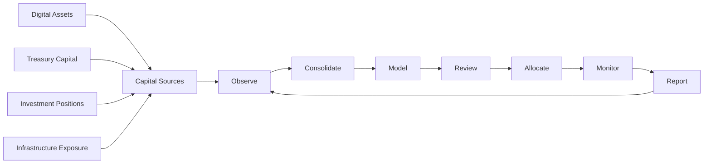
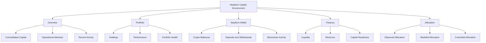
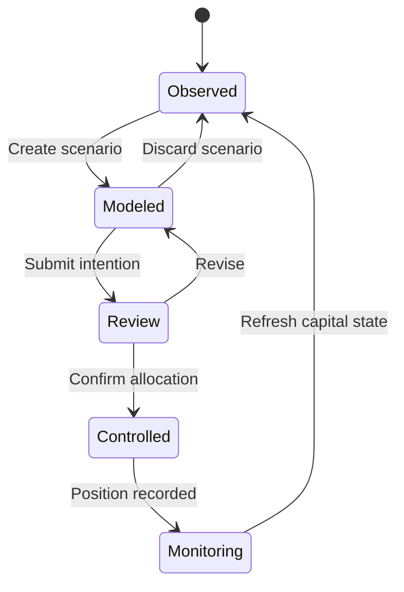
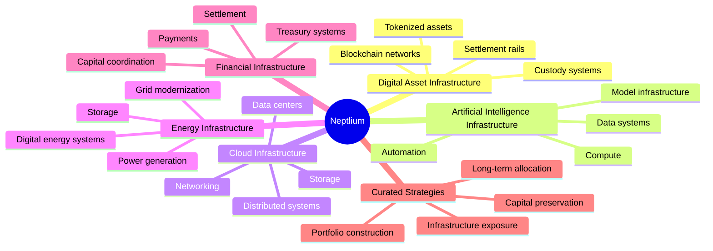
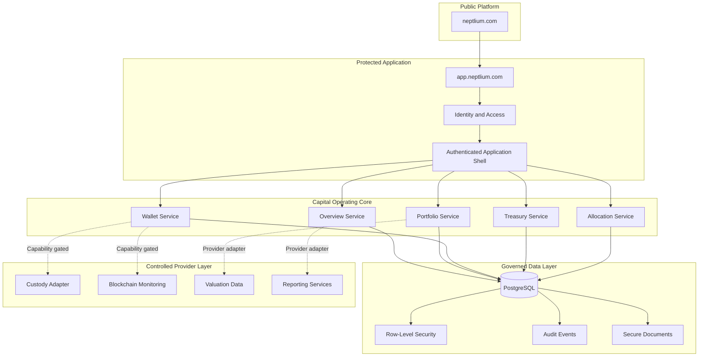
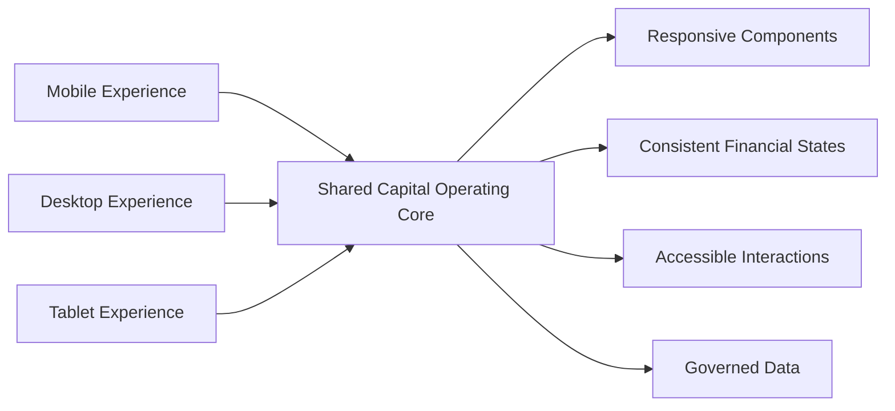
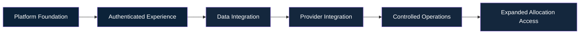

<div align="center">

# NEPTLIUM

### Capital Operating Infrastructure for Modern Investors

**Observe capital. Model positioning. Allocate deliberately. Monitor continuously.**

[neptlium.com](https://neptlium.com) · [Access the Platform](https://app.neptlium.com)

</div>

---

## The Neptlium Thesis

Capital is increasingly distributed across digital assets, private opportunities, infrastructure exposure, treasury reserves, and professionally managed strategies.

The systems used to understand and govern that capital remain fragmented.

**Neptlium is building the operating environment that brings capital visibility, portfolio intelligence, digital-asset infrastructure, treasury coordination, and controlled allocation into one disciplined platform.**

Neptlium is designed around a simple question:

> **Where is capital positioned now, and what changes when it is reorganized?**

It is not designed as a speculative trading terminal, consumer bank, crypto casino, or black-box investment bot.

---

## The Capital Operating Model



Neptlium separates capital intelligence from capital execution.

Every movement should be:

- Visible
- Intentional
- Reviewable
- Permissioned
- Traceable
- Supported by real infrastructure

---

## The Platform

The authenticated Neptlium environment is organized around five primary operating destinations.

| Platform area | Operating purpose |
|---|---|
| **Overview** | Consolidated visibility across capital, portfolios, wallet positions, and pending activity |
| **Portfolio** | Holdings, allocation, liquidity, concentration, performance, and portfolio health |
| **Neptlium Wallet** | Crypto balances, deposits, withdrawals, funding references, and blockchain transaction monitoring |
| **Treasury** | Liquidity, reserves, exposure, capital readiness, and treasury positioning |
| **Allocation** | Observed positioning, allocation modeling, controlled allocation, and ongoing monitoring |



---

## Allocation Intelligence

Neptlium’s allocation system is designed around three distinct modes.

### 01 — Observed Allocation

A truthful representation of where capital is currently positioned.

This includes:

- Asset exposure
- Portfolio weight
- Available liquidity
- Reserved capital
- Concentration
- Network and custody status
- Pending capital activity

### 02 — Modeled Allocation

A controlled environment for understanding possible changes before capital is moved.

Investors can evaluate:

- Proposed allocation structures
- Liquidity impact
- Concentration changes
- Capital requirements
- Risk considerations
- Expected operational consequences

### 03 — Controlled Allocation

An explicit, reviewable process for submitting an allocation after the investor understands the proposed position.



Neptlium must never silently reorganize capital or present modeled outcomes as guaranteed returns.

---

## Infrastructure Universe

Neptlium is being designed to organize capital across a broader infrastructure economy.



Availability must always depend on jurisdiction, investor eligibility, operational readiness, provider support, and applicable regulatory requirements.

---

## System Architecture



---

## Engineering Principles

### Truthful Financial Interfaces

Neptlium does not fabricate balances, performance, transactions, wallet addresses, funding references, or investment availability.

When infrastructure is unavailable, the interface must communicate that state clearly.

### Crypto-Only Funding Direction

Customer wallet funding is designed around:

```text
Crypto asset → Blockchain network → Deposit address → Confirmation tracking
```

Fiat currency may be used as a reporting denomination, but it must not be misrepresented as a supported deposit method.

### Provider-Gated Custody

Deposit addresses, transaction monitoring, confirmations, and withdrawals must only become available after a real custody or blockchain provider has been securely integrated.

Permanent custody addresses must never be generated in browser code.

### Controlled Execution

Neptlium separates:

1. Capital observation  
2. Allocation modeling  
3. Investor review  
4. Explicit confirmation  
5. Controlled execution  
6. Continuous monitoring  

### Security by Default

The platform is engineered around:

- Server-side authorization
- Row-level database security
- Least-privilege access
- Protected administrative operations
- Auditable capital events
- Session security
- Capability-gated financial operations
- Strict separation of public and privileged credentials
- No private keys or signing material in frontend code

---

## Experience Architecture

Neptlium is mobile-first without reducing desktop capability.



Every critical experience must support:

- Loading
- Empty
- Unavailable
- Error
- Pending
- Success
- Populated data
- Mobile-safe financial values
- Accessible keyboard and touch interaction

---

## Technology Foundation

The Neptlium platform is being developed with:

- **Next.js**
- **React**
- **TypeScript**
- **Turborepo**
- **pnpm**
- **Supabase**
- **PostgreSQL**
- **Row-Level Security**
- **Vercel**
- **Modular provider adapters**
- **Shared design and UI systems**

Technology serves the operating model. It does not define the product.

---

## Platform Boundaries

Neptlium is not:

- A retail cryptocurrency exchange
- A high-frequency trading terminal
- A consumer banking interface
- A social-investing network
- A guaranteed-return platform
- An autonomous system that secretly moves investor capital

Neptlium is being built as a disciplined capital operating environment where information, intent, infrastructure, and execution remain clearly separated.

---

## Development Position



Neptlium is under active development.

Financial and custody capabilities must remain unavailable until the required backend, security, compliance, and provider infrastructure is operationally ready.

---

## Neptlium Labs

This GitHub account is the engineering home for Neptlium’s platform architecture, product systems, infrastructure research, and controlled development.

Our work focuses on one long-term objective:

> **Build the intelligent operating infrastructure through which modern investors can understand, organize, and allocate capital with greater discipline.**

---

<div align="center">

### Capital, made operational.

[Explore Neptlium](https://neptlium.com) · [Access the Platform](https://app.neptlium.com)

<br />

<sub>
Neptlium is under active development. Platform information does not constitute investment, legal, tax, or financial advice. Product availability may depend on jurisdiction, eligibility, verification, provider support, and applicable regulation.
</sub>

<br /><br />

© 2026 Neptlium. All rights reserved.

</div>
